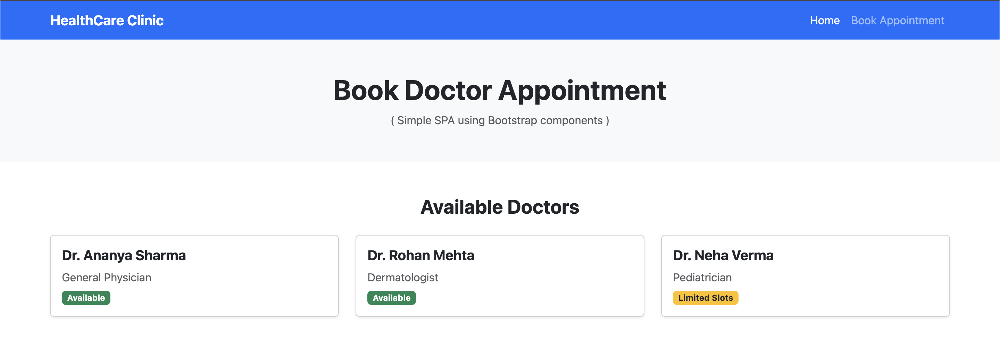
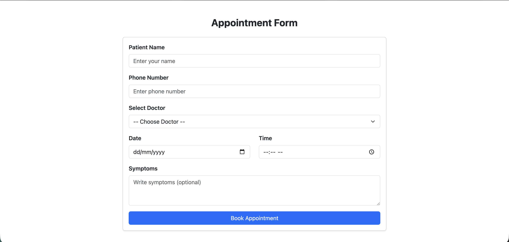
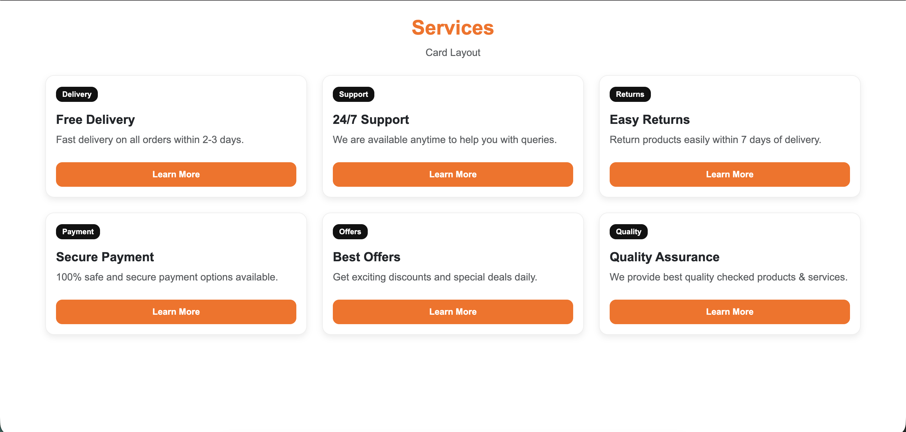
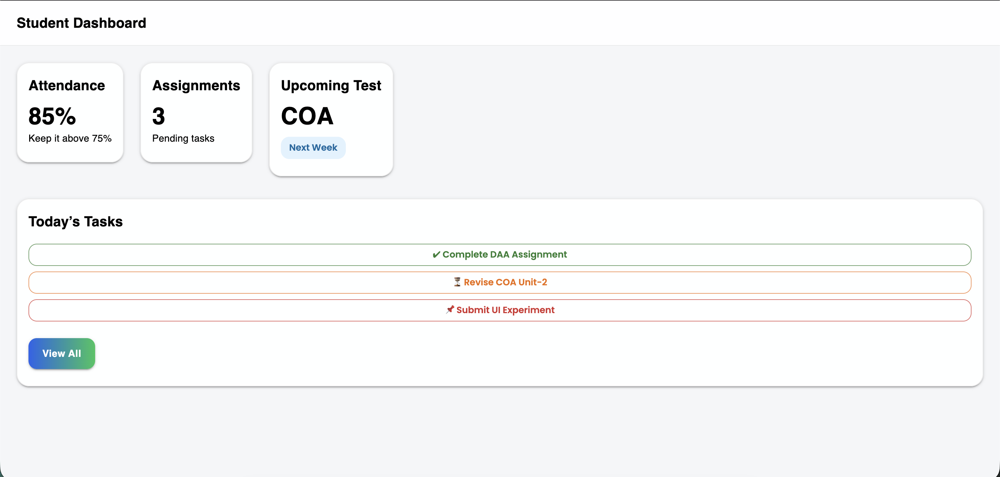
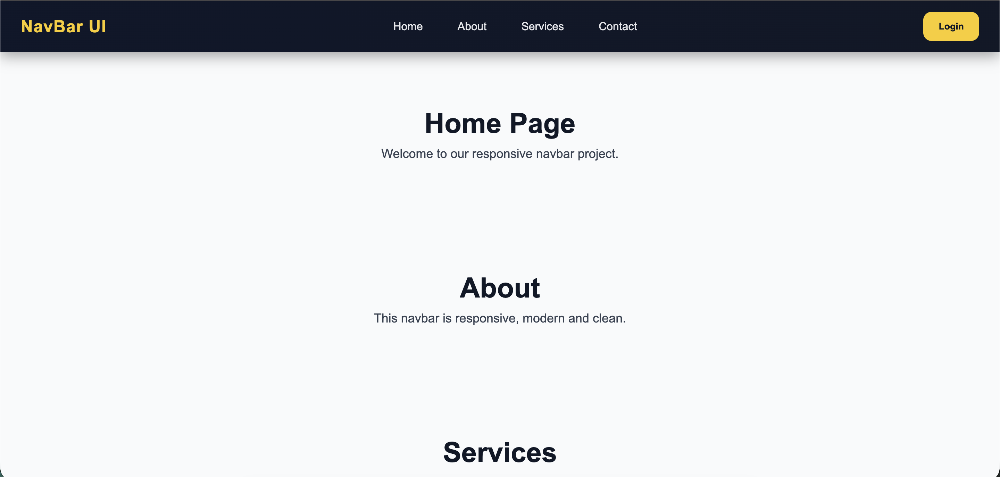

# 📌 Exp-2 (SPA Projects)

This folder contains **4 React SPA experiments** created using different UI approaches like **Bootstrap, Material UI, and custom CSS**.

---

## 📂 Experiments Included

### 1) Bootstrap Doctor Appointment
📁 Folder: `bootstrap-doctor-appointment`  
A simple doctor appointment booking UI made using **Bootstrap components**.

<p align="center">
  
  
</p>

---

### 2) Card Layout
📁 Folder: `card-layout`  
A clean card-based layout UI for practice of **cards, spacing, alignment, and design**.

📸 Screenshot:  


---

### 3) Material UI
📁 Folder: `material-ui`  
A UI design created using **Material UI components** like cards, buttons, typography etc.

📸 Screenshot:  


---

### 4) Navbar
📁 Folder: `navbar`  
A responsive navigation bar created using React with a clean UI.

📸 Screenshot:  


---

## ▶️ How to Run Any Experiment

1. Go inside the experiment folder  
2. Install dependencies  
3. Start the project

Example:

```bash
cd navbar
npm install
npm start