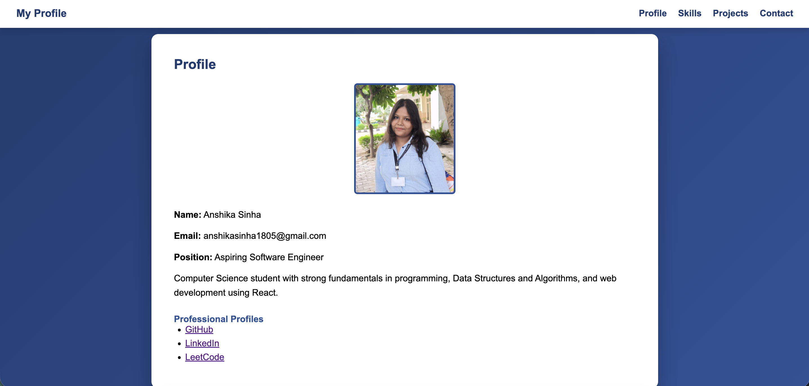
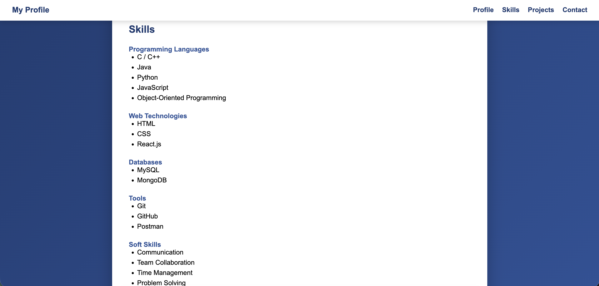
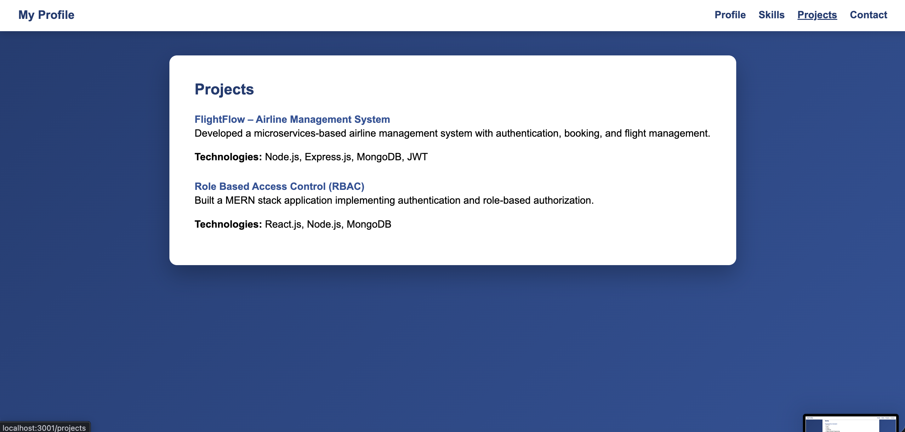
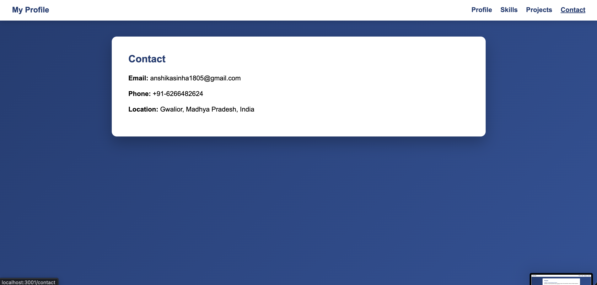

# Student Portfolio – React SPA (Exp-3)

## Overview
This project is a Student Portfolio Single Page Application (SPA) developed using React and React Router.  
It demonstrates client-side routing and component-based design, allowing smooth navigation without page reloads.

---

## Tech Stack
- React
- React Router DOM
- HTML5
- CSS3
- JavaScript (ES6)
- Git & GitHub

---

## Features
- Profile page opens by default
- Header-based navigation
- Client-side routing without page reload
- Separate pages for Profile, Skills, Projects, and Contact
- Clean and user-friendly interface

---

## Project Structure
student-portal/
├─ src/
│   ├─ assets/
│   │   └─ my_photo.png
│   ├─ components/
│   │   └─ Header.js
│   ├─ pages/
│   │   ├─ Profile.js
│   │   ├─ Skills.js
│   │   ├─ Projects.js
│   │   ├─ Contact.js
│   │   └─ Dashboard.js
│   ├─ App.js
│   ├─ App.css
│   └─ index.js
└─ README.md

