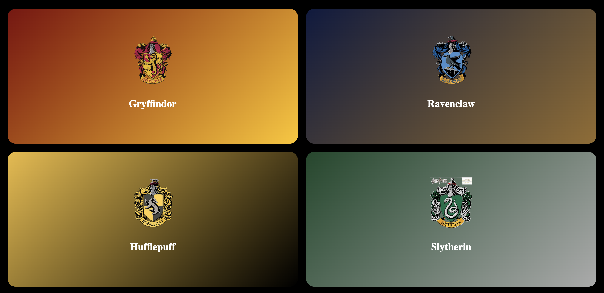
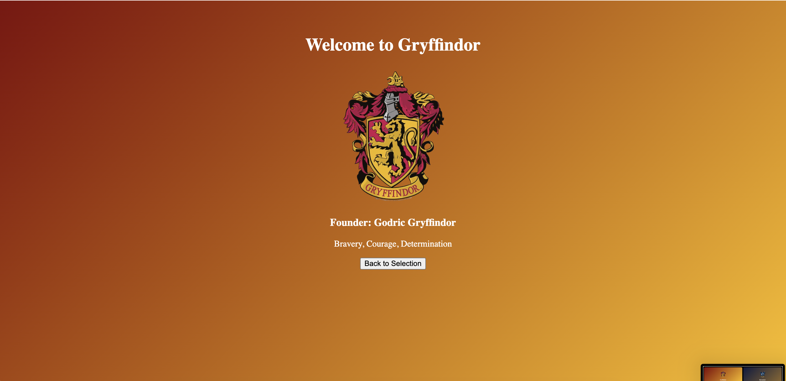
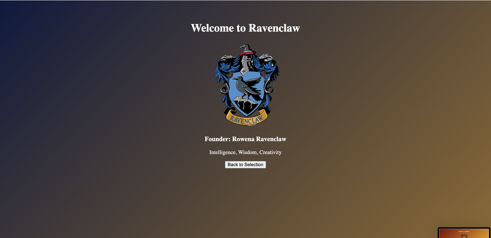
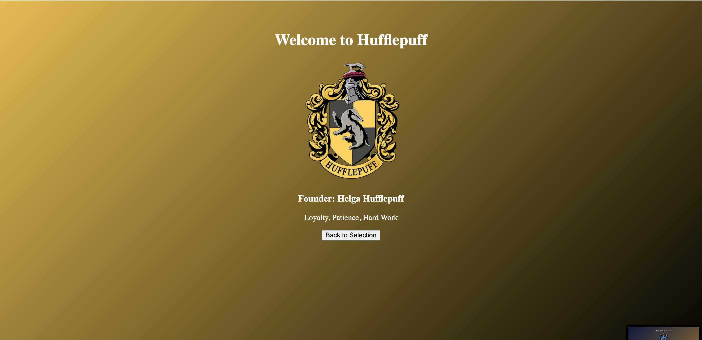
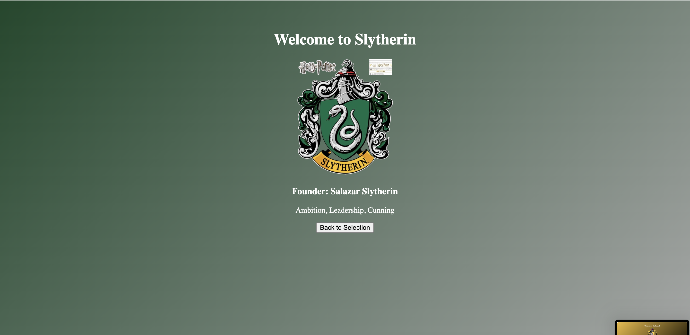

# 🏰 Hogwarts House Theme Selector
## React Context API – Global State Management Project

This project demonstrates **Global State Management using React Context API** by building an interactive Hogwarts House selection application inspired by the Harry Potter universe.

Users can select a Hogwarts house from a full-screen grid layout, and the application dynamically updates the entire interface based on the selected house theme.

---

## 🎯 Aim

To implement global state management in a Single Page Application using **React Context API** and demonstrate dynamic UI updates without prop drilling.

---

## ✨ Features

✅ Full-screen Hogwarts house selection screen  
✅ 4-house responsive grid layout  
✅ Gradient themed cards  
✅ Dynamic UI based on selected house  
✅ Global state management using Context API  
✅ Conditional rendering between pages  
✅ Interactive hover effects  
✅ House information dashboard  

---

## 🧠 Concept Used

- React Context API
- useContext Hook
- Global State Management
- Conditional Rendering
- Component Reusability
- Dynamic Styling

---

## 🏗️ Project Structure
src/
 ┣ context/
 ┃ ┗ HouseContext.js
 ┣ pages/
 ┃ ┣ SelectHouse.js
 ┃ ┗ HouseDashboard.js
 ┣ components/
 ┃ ┗ HouseCard.js
 ┣ App.js
 ┗ index.js

 ---

## ⚙️ How It Works

1. The application opens with a **house selection screen**.
2. Each house card represents a Hogwarts house with gradient styling.
3. When a user selects a house:
   - The selected house is stored in **Context API**.
   - The app navigates to the House Dashboard.
4. All components access the same global state and update automatically.

This eliminates **prop drilling** and ensures centralized state management.

---

## 📸 Screenshots

### 🪄 House Selection Screen

### 🦁 Gryffindor Dashboard

### 🦅 Ravenclaw Dashboard

### 🦡 Hufflepuff Dashboard

### 🐍 Slytherin Dashboard

---

## 🚀 Installation & Setup

1. Clone the repository
git clone 

2. Navigate into project
cd house-theme

3. Install dependencies
npm install

4. Run the project
npm start

