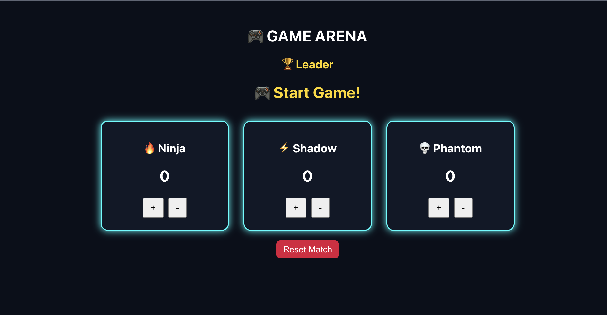
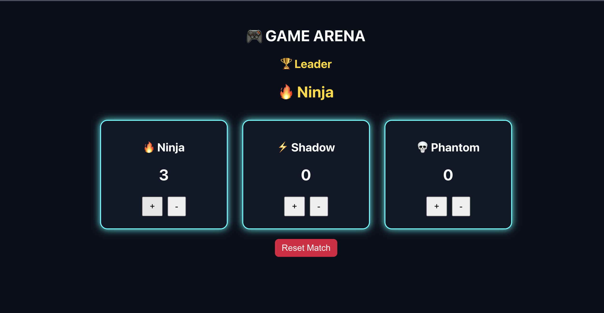
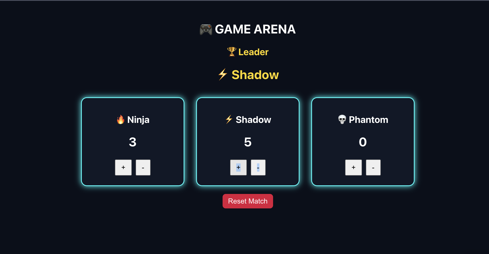

# 🎮 Redux Game Arena – Scoreboard Application

A gaming-themed scoreboard application built using **React** and **Redux Toolkit** to demonstrate centralized state management.

This project was developed as part of **Experiment-2: State Management Using Redux** in a Single Page Application (SPA).

---

## 🎯 Aim

To implement centralized state management using **Redux Toolkit** in a React application and demonstrate how multiple components share and update global state efficiently.

---

## ✨ Features

✅ Gaming themed UI (dark neon style)  
✅ Multiple players with live score updates  
✅ Increase / decrease player scores  
✅ Automatic leader detection 👑  
✅ "Start Game" message when scores are zero  
✅ Reset match functionality  
✅ Centralized global state using Redux

---

## 🧠 Concepts Used

- Redux Toolkit
- Redux Store
- Slices & Reducers
- Actions & Dispatch
- useSelector & useDispatch Hooks
- Component-based architecture
- Global state management

---

## 🏗️ Project Structure
src/
│
├── app/
│   └── store.js              
│
├── features/
│   └── scoreboard/
│        └── scoreSlice.js    
│
├── components/
│   ├── PlayerCard.js
│   └── LeaderBoard.js
│
├── pages/
│   └── GameArena.js
│
├── App.js
├── App.css
├── index.js
└── index.css

---

## ⚙️ How It Works

1. Redux Store maintains a global list of players and their scores.
2. Components dispatch actions to update scores.
3. Reducers modify the centralized state.
4. All subscribed components automatically re-render when state changes.
5. The leaderboard dynamically detects the highest scoring player.

---

## 📸 Screenshots

### 🎮 Game Arena

### 🏆 Leader Detection

### ⚡ Score Update Gameplay

---

## 🚀 Installation & Setup

1. Clone repository
git clone

2. Navigate to project
cd redux-scoreboard

3. Install dependencies
npm install

4. Run application
npm start

---

## 🧩 Technologies Used

- React.js
- Redux Toolkit
- JavaScript (ES6)
- HTML5 & CSS3

---

## 🎓 Learning Outcomes

- Understanding centralized state management
- Managing shared application state using Redux
- Implementing reducers and actions
- Building scalable React applications

---

## 👩‍💻 Author

**Anshika Sinha**

---

## ⭐ Future Improvements

- Leader crown animation 👑
- Sound effects on score update
- Player avatars
- Match timer system
- Online multiplayer scoreboard