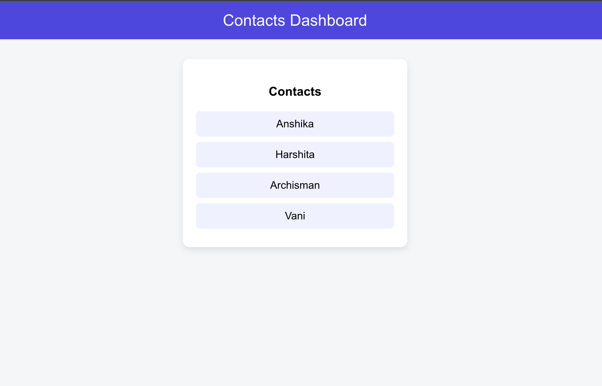
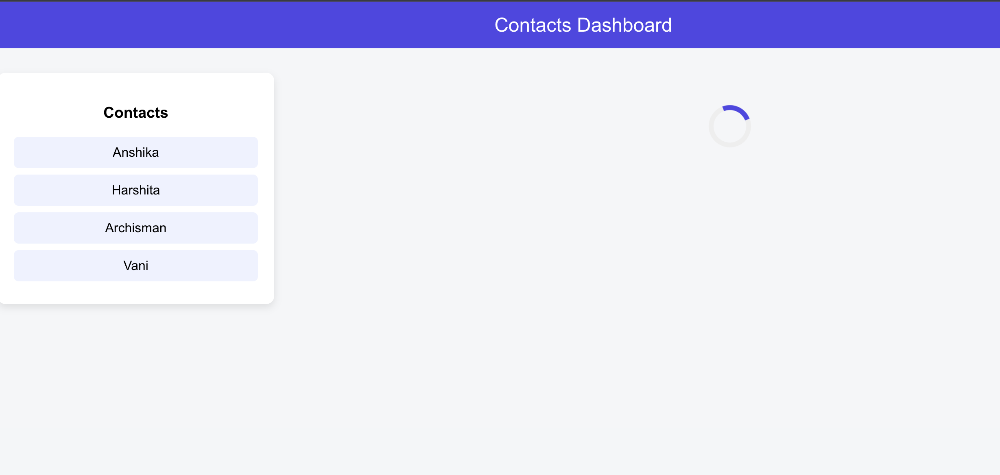
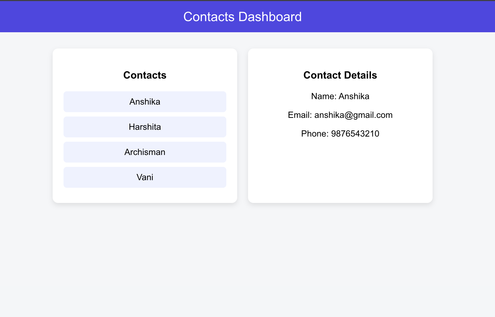

# 📇 Contacts Dashboard – Component Lazy Loading (React)

A simple React dashboard application built to demonstrate **Component Lazy Loading** using `React.lazy()` and `Suspense`.

This project is developed as part of the **Full Stack Development Lab** experiment to understand performance optimization in Single Page Applications (SPA).

---

## 🚀 Project Overview

The application displays a **Contacts Dashboard** where:

- Contact list loads immediately on page load.
- Contact details are loaded **only when a contact is selected**.
- Lazy loading reduces the initial bundle size and improves performance.

This clearly demonstrates how modern React applications load components **on demand** instead of loading everything at once.

---

## Screenshots

### 📌 Contacts Dashboard


---

### ⏳ Lazy Loading in Action (Loader)


---

### 👤 Contact Details Loaded


---

## ⚙️ How Lazy Loading Works Here

- The **ContactList** component loads normally.
- The **ContactDetails** component is imported using:

```js
const ContactDetails = React.lazy(() =>
  import("./components/ContactDetails")
);