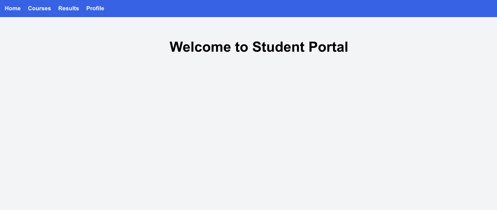
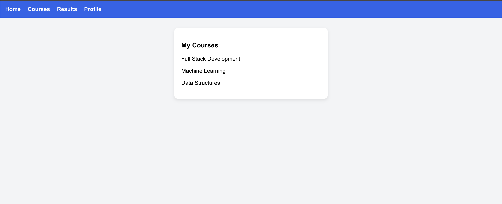
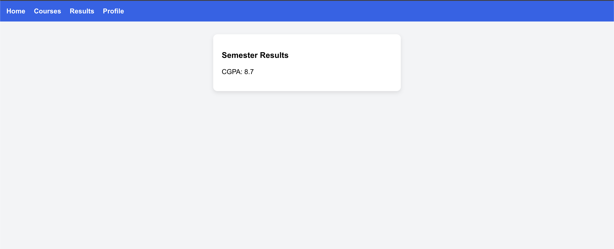
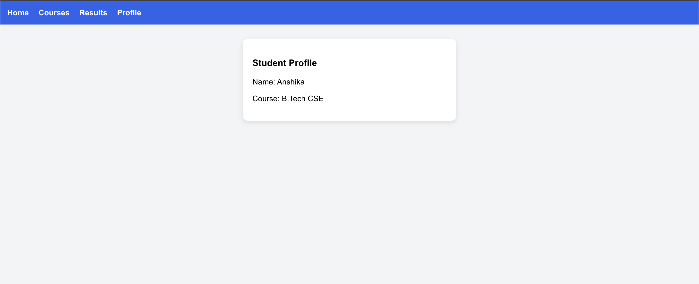

# 🎓 Student Portal – Route Based Lazy Loading (React SPA)

This project demonstrates **Route-Based Lazy Loading** in a Single Page Application (SPA) using React.

It is developed to understand frontend performance optimization using dynamic routing.

---

## 🚀 Project Overview

The application is a simple **Student Portal Dashboard** containing multiple sections:

- 🏠 Home
- 📚 Courses
- 📊 Results
- 👤 Profile

Each page (route) is loaded **only when the user navigates to it**, reducing the initial bundle size and improving application performance.

---

## 🧪 Experiment Objective

To implement **Route-Based Lazy Loading** using:

- `React.lazy()`
- `Suspense`
- React Router DOM
- Dynamic imports (Code Splitting)

---

### Screenshots

## Home

  

## Courses Page

  

## Results Page

  

## Profile Page

  

