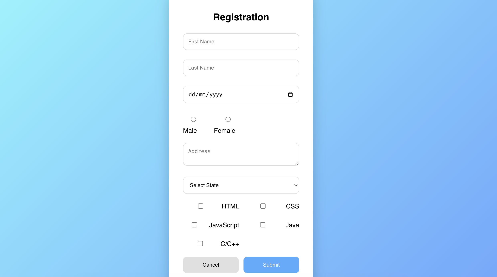
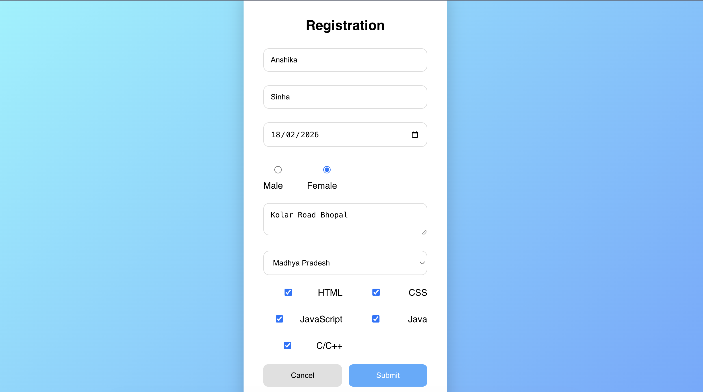
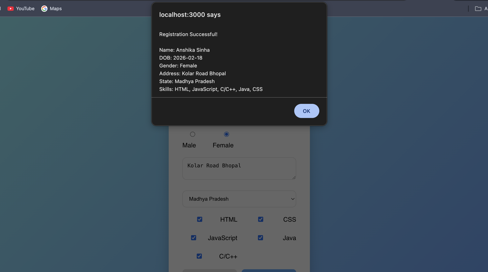

# Registration Form using React (Controlled Components)

## 📌 Overview
This project is a **Registration Form built using React** that demonstrates the concept of **Controlled Components**.

The form collects user information and displays all submitted details through an alert message after successful submission.

The UI is centered on the screen with a clean and aesthetic design.

---

## 🎯 Features
- Controlled form inputs using React `useState`
- First Name & Last Name fields
- Date of Birth (future dates restricted)
- Gender selection (Radio buttons)
- Address input (Textarea)
- State selection (Dropdown)
- Skills selection (Checkboxes)
- Submit & Cancel functionality
- Alert popup showing submitted data
- Responsive centered layout

---

## 🛠️ Technologies Used
- React.js
- JavaScript (ES6)
- HTML5
- CSS3

---

## 📸 Screenshots

### 📝 Registration Form

---

### ✏️ Filled Form

---

### ✅ Alert Message After Submission

---

## 🧪 Validation Implemented
- Date of Birth cannot be a future date.
- Cancel button resets the entire form.
- All inputs handled using controlled components.

---

## 🧠 Learning Outcomes
- Understanding Controlled Components
- Managing form state with `useState`
- Handling multiple input types in React
- Implementing client-side validation
- Designing responsive UI

---

## 👩‍💻 Author
**Anshika Sinha**

---

## 📄 License
This project is developed for academic learning purposes.