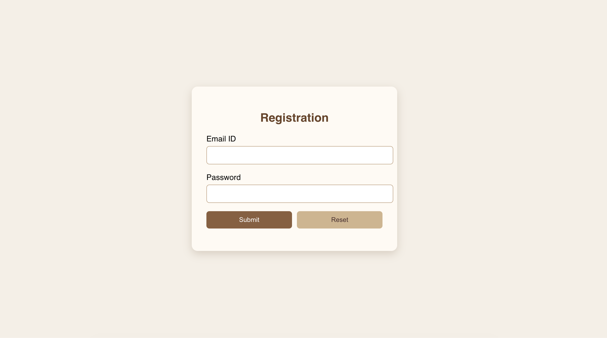
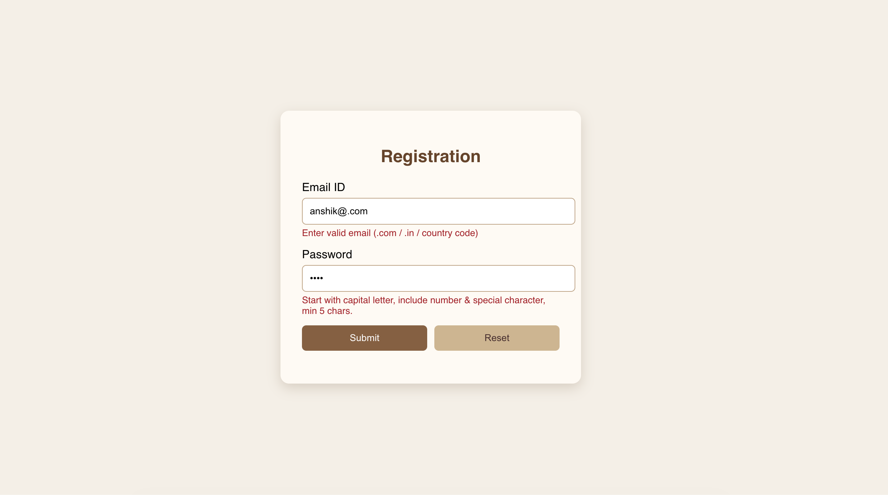
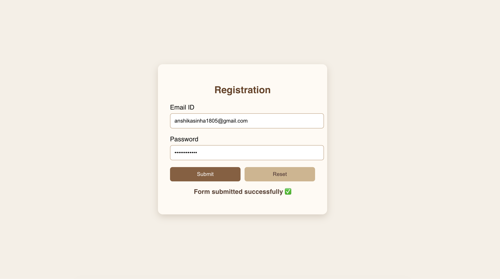

# Email & Password Validation Form (React)

## 📌 Project Overview
This project is a **Registration/Login Form** built using **React.js** demonstrating form handling with **Controlled Components**.

The form accepts an Email ID and Password, performs validation checks, and displays a success message upon valid submission.

The application focuses on input validation logic and clean user interface design.

---

## 🎯 Features
- Controlled inputs using React `useState`
- Email validation with custom rules
- Password strength validation
- Error messages displayed below inputs
- Reset button to clear form
- Success message after valid submission
- Centered aesthetic UI design

---

## ✅ Validation Rules

### 📧 Email Validation
- Only letters and numbers allowed before `@`
- No special characters allowed before `@`
- Must follow valid email format
- Allowed domains:
  - `.com`
  - `.in`
  - country code domains

**Examples**

✔ `anshika123@gmail.com`  
✔ `user45@yahoo.in`

❌ `anshika.s@gmail.com`  
❌ `anshika_12@gmail.com`  
❌ `anshika!@gmail.com`

---

### 🔐 Password Validation
Password must:
- Start with a **capital letter**
- Contain at least **one number**
- Contain at least **one special character**
- Minimum length: **5 characters**

Example:
✔ `Aabc@1`

---

## 🛠️ Technologies Used
- React.js
- JavaScript (ES6)
- HTML5
- CSS3 (Inline Styling)

---

## 📸 Screenshots

### 🔹 Login Form

---

### 🔹 Filled Form With Wrong Format

---

## 🧠 Learning Outcomes
- Understanding Controlled Components in React
- Form validation using regular expressions
- Managing multiple state variables
- Handling submit and reset events
- Designing responsive UI layouts

---

## 👩‍💻 Author
**Anshika Sinha**

---

## 📄 License
This project is created for academic and learning purposes.

### 🔹 Alert Message
